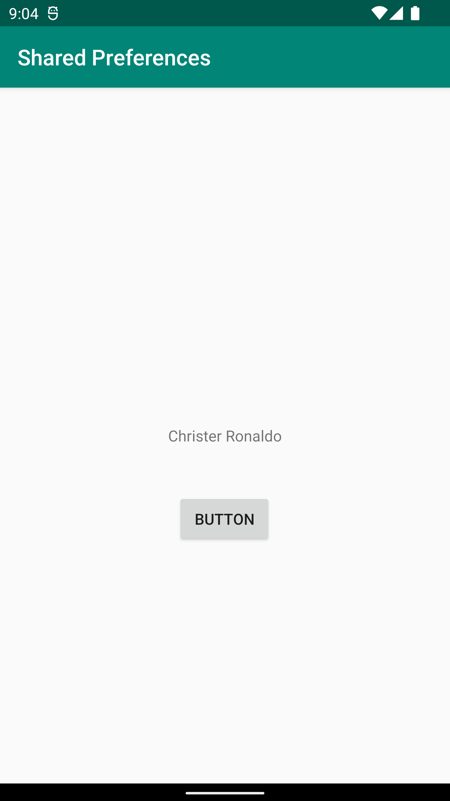
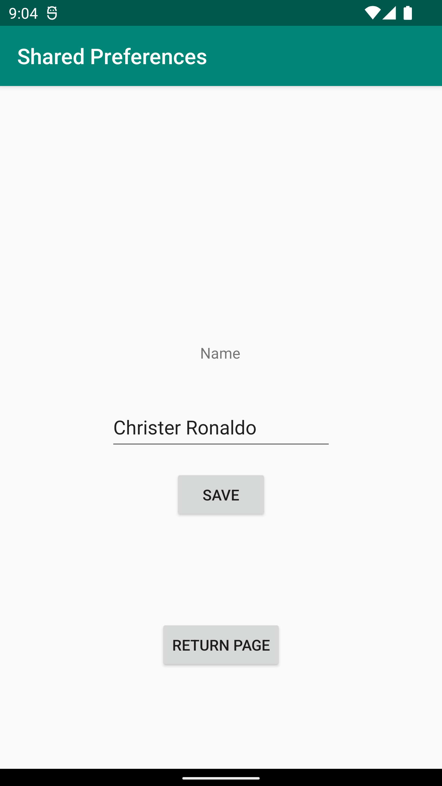

# Rapport

**Raman Mohammed - SharedPreferences**
The  projected started with creating Another Activity with uml. The plan was the data will be written inside of SecondActivity.
This will require  a "saving" button, "return  button", "Edit text panel" and  "Textview".

The secondactivity consist of:

```
   nameEdit = findViewById(R.id.nameEdit);
   saveBtn = findViewById(R.id.saveBtn);
   returnBtn = findViewById(R.id.returnBtn);

    sh =  getSharedPreferences("UsersPrefs", Context.MODE_PRIVATE);
```

The save button will save  our data and also notify the user with the Toast message that the information has been saved.
The sharedpreference will be saved into the **UsersPrefs**
```
       saveBtn.setOnClickListener(new View.OnClickListener() {
       @Override
       public void onClick(View view) {
                    nameStr = nameEdit.getText().toString();
                    SharedPreferences.Editor editor = sh.edit();

                    editor.putString("name", nameStr);
                    editor.apply();
                    Toast.makeText(SecondActivity.this, "Information Saved", Toast.LENGTH_LONG).show();
                }
            });
```
            Return button will redirect user to the mainpage
```
        returnBtn.setOnClickListener(new View.OnClickListener() {
            @Override
            public void onClick(View view) {
                startActivity(new Intent(SecondActivity.this, MainActivity.class));
            }
        });
```
MainActivity consist of a  button  to direct secondactivity also  getting the context from secondactivity through sharedpreference
 ```
        button = findViewById(R.id.button);
        button.setOnClickListener(new View.OnClickListener() {
            @Override
            public void onClick(View v) {
                startActivity(new Intent(MainActivity.this, SecondActivity.class));
            }
        });

        name = findViewById(R.id.showName);
        SharedPreferences sh = getApplicationContext().getSharedPreferences("UsersPrefs", Context.MODE_PRIVATE);
        nameStr = sh.getString("name", "");

        name.setText(nameStr);
 ```




